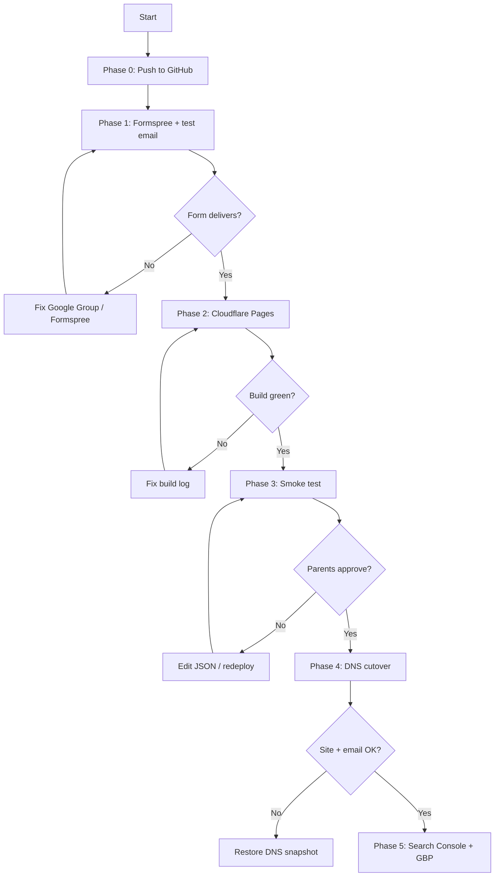

# Deployment runbook — zero-gap sequence

**Read this top to bottom. Do not skip steps.**

| Phase | Goal | Domain | Email risk |
|-------|------|--------|------------|
| **0** | Push latest code | — | None |
| **1** | Formspree live | — | None |
| **2** | Cloudflare Pages preview | `*.pages.dev` | None |
| **3** | Smoke test + parent sign-off | preview URL | None |
| **4** | Production DNS cutover | `marevaplaya.com.mx` | **High if MX touched** |
| **5** | Search + GBP | production | None |
| **6** | Deferred | `marevaplaya.com` redirect | None |

---

## Phase 0 — Push latest code (5 min)

**Why first:** Cloudflare builds from GitHub. Unpushed fixes won't deploy.

```powershell
cd d:\Personal\Mareva
git add -A
git status   # confirm no .env file staged
git commit -m "Quality audit fixes and deployment runbook"
git push origin main
```

**Verify:** [github.com/Selgadis84/mareva-playa](https://github.com/Selgadis84/mareva-playa) shows latest commit.

**Gate:** Do not proceed until GitHub has the latest `main`.

---

## Phase 1 — Formspree (15 min)

**Why before Cloudflare:** Contact form is **disabled in production** without `PUBLIC_FORMSPREE_ID`. Setting the env var later requires a redeploy (automatic on save, but plan for it).

### 1.1 Create form

1. [formspree.io](https://formspree.io) → sign up / sign in (recommend `selgadis84@gmail.com`).
2. **+ New form** → name: `Mareva Playa Contact`.
3. **Email notifications** → `reservas@marevaplaya.com.mx`.

### 1.2 Verify delivery path (critical — easy to miss)

Formspree sends a confirmation email. It must reach `reservas@`:

1. Check the **Google Group** inbox for `reservas@marevaplaya.com.mx` (whoever receives group mail).
2. Click Formspree's verification link if required.
3. Send a **test submission** from Formspree dashboard → confirm it arrives at the group.

**If email doesn't arrive:**

- In **Google Groups** → `reservas@` settings → **Post permissions** must allow **Anyone on the internet** (or Formspree verification and submissions will bounce silently).
- Check the group has at least one member who receives mail.
- Check spam folder for Formspree confirmation.
- Try notification to `selgadis84@gmail.com` temporarily, then switch after debugging.
- Do **not** go live on production domain until form delivery works.

**Formspree free tier:** 50 submissions/month. Sufficient for inquiry-only launch; upgrade if volume grows.

### 1.3 Save form ID

From URL `https://formspree.io/f/abcxyz` → ID is **`abcxyz`**.

Write it here: `PUBLIC_FORMSPREE_ID=________________`

**Gate:** Test submission received at `reservas@` (or confirmed working inbox).

---

## Phase 2 — Cloudflare Pages preview (20 min)

**Prerequisites:**

- [ ] Cloudflare account (free): [dash.cloudflare.com/sign-up](https://dash.cloudflare.com/sign-up)
- [ ] GitHub `Selgadis84` authorized in Cloudflare
- [ ] Phase 0 complete
- [ ] Form ID from Phase 1 ready

**Note:** Domain `marevaplaya.com.mx` does **NOT** need to be in Cloudflare yet. Preview uses `*.pages.dev`.

### 2.1 Create project

1. [Cloudflare Dashboard](https://dash.cloudflare.com) → **Workers & Pages** → **Create** → **Pages** → **Connect to Git**.
2. **GitHub** → authorize → select **`Selgadis84/mareva-playa`**.
3. **Project name:** `mareva-playa` (becomes `mareva-playa.pages.dev`).
4. **Production branch:** `main`.

### 2.2 Build settings (exact values)

| Setting | Value |
|---------|-------|
| Framework preset | Astro |
| Build command | `npm run build` |
| Build output directory | `dist` |
| Root directory | `/` (leave empty) |

### 2.3 Environment variables

Add for **both Production AND Preview** (click "Add variable" for each environment):

| Variable | Value |
|----------|-------|
| `NODE_VERSION` | `22` |
| `PUBLIC_FORMSPREE_ID` | *(form ID from Phase 1)* |

Optional later:

| Variable | Value |
|----------|-------|
| `PUBLIC_TURNSTILE_SITE_KEY` | Cloudflare Turnstile site key |

### 2.4 Deploy

1. **Save and Deploy**.
2. Wait for green ✓ (typically 1–3 min).
3. Note preview URL: `https://mareva-playa.pages.dev`

### 2.5 If build fails

| Error | Fix |
|-------|-----|
| Node version | Set `NODE_VERSION=22` |
| `npm run build` failed | Check build log; run locally: `npm run build` |
| Module not found | Ensure `package-lock.json` is committed |

**Gate:** Build succeeds; preview URL loads homepage.

**Expected on preview:** Canonical URLs, sitemap, and OG tags reference `https://marevaplaya.com.mx` (hardcoded in `astro.config.mjs`). That is correct — preview is for content/functionality testing, not SEO. Do not submit the preview sitemap to Search Console.

**After setup:** Every push to `main` auto-redeploys Production. Preview deployments also run on PRs if enabled.

---

## Phase 3 — Smoke test + parent sign-off (30 min)

Test on **`https://mareva-playa.pages.dev`** (not localhost).

### 3.1 Automated checklist

| # | Test | URL | Pass |
|---|------|-----|------|
| 1 | Home ES | `/` | ☐ |
| 2 | Home EN | `/en/` | ☐ |
| 3 | Alojamientos | `/alojamientos` | ☐ |
| 4 | Accommodations | `/en/accommodations` | ☐ |
| 5 | Servicios | `/servicios` | ☐ |
| 6 | Gallery EN | `/en/gallery` | ☐ |
| 7 | Ubicación + map | `/ubicacion` | ☐ |
| 8 | Contact + form | `/contacto` | ☐ |
| 9 | Privacy ES/EN | `/aviso-de-privacidad`, `/en/privacy` | ☐ |
| 10 | Language switcher | any page → toggle ES/EN | ☐ |
| 11 | WhatsApp button | opens `wa.me/527445860428` | ☐ |
| 12 | Contact form submit | lands in `reservas@` inbox | ☐ |
| 13 | 404 page | `/this-does-not-exist` | ☐ |
| 14 | Mobile layout | phone or narrow browser | ☐ |
| 15 | Sitemap | `/sitemap-index.xml` returns XML (URLs will show `.com.mx`) | ☐ |
| 16 | Security headers | DevTools → Response headers on any page | ☐ |

### 3.2 Parent sign-off (blocker for Phase 4)

Share preview URL. Parents must confirm:

- [ ] Room prices in `src/data/rooms.json` are correct
- [ ] Copy reads well (Spanish)
- [ ] Phone number and address are correct
- [ ] Placeholder photos are acceptable for now

**Gate:** All smoke tests pass + parent verbal/written OK.

---

## Phase 4 — Production DNS cutover (30 min)

**Only after Phase 3 gate passed.**

### 4.0 BEFORE touching DNS

1. Complete [DNS-SNAPSHOT-TEMPLATE.md](./DNS-SNAPSHOT-TEMPLATE.md) — **including current web A/CNAME records** (what does `marevaplaya.com.mx` point to today?).
2. Screenshot all MX records in Google Admin.
3. Pick **canonical URL:** `https://marevaplaya.com.mx` (apex, no www).
4. **Optional (recommended):** 24 h before cutover, lower TTL on existing web records to 300 s if Google DNS allows — faster rollback if something goes wrong.

### 4.1 Add custom domains in Cloudflare Pages

1. Pages project → **Custom domains** → **Set up a custom domain**.
2. Add **`marevaplaya.com.mx`** (apex).
3. Add **`www.marevaplaya.com.mx`**.

Cloudflare shows **exact DNS records** to create. Copy them.

### 4.2 Update Google DNS (web only)

In **Google Domains / Google Admin** for `marevaplaya.com.mx`:

**ADD** only what Cloudflare Pages instructs (typically):

- `www` → CNAME → `mareva-playa.pages.dev` (or Cloudflare target)
- `@` apex → A records or CNAME per Cloudflare wizard

**DO NOT:**

- Change nameservers away from Google
- Modify, delete, or shorten TTL on **MX** records
- Remove SPF/DKIM **TXT** records

### 4.3 Configure www redirect

In Cloudflare Pages → custom domains:

- Set **`marevaplaya.com.mx`** as primary.
- Enable redirect **`www.marevaplaya.com.mx` → `marevaplaya.com.mx`**.

### 4.4 Wait and verify (15–60 min propagation)

| Check | Expected |
|-------|----------|
| `https://marevaplaya.com.mx` | New site loads, valid SSL |
| `https://www.marevaplaya.com.mx` | Redirects to apex |
| Email to `info@marevaplaya.com.mx` | Received |
| Email to `reservas@marevaplaya.com.mx` | Received |
| Contact form on live site | Submission → `reservas@` |

**Rollback:** If email breaks → restore DNS snapshot web records only. MX unchanged = email should recover.

**Gate:** Site live + email works + form works on production domain.

---

## Phase 5 — Search & Google Business (20 min)

**Only after Phase 4 gate passed** (site live on production domain).

1. [Google Search Console](https://search.google.com/search-console) → add property `https://marevaplaya.com.mx`
2. Verify via DNS TXT (Google gives you a record — **add in Google DNS alongside existing records; do not remove MX/SPF**)
3. Submit sitemap: `https://marevaplaya.com.mx/sitemap-index.xml` (not the `.pages.dev` URL)
4. **Google Business Profile** → update website to `https://marevaplaya.com.mx`
5. Replace Google Reviews footer link with exact GBP URL when available
6. Request indexing for homepage (optional, speeds discovery)

---

## Phase 6 — Deferred (no deadline)

| Task | Trigger | Doc |
|------|---------|-----|
| `marevaplaya.com` → `.com.mx` 301 | When registrar identified | [redirects.md](./redirects.md) |
| Cancel SEMSEO | After `.com` redirect live | — |
| High-res photos | When photo shoot done | [PHOTO-SWAP.md](./PHOTO-SWAP.md) |
| Turnstile anti-spam | If form gets spam | [DEPLOY.md](./DEPLOY.md) |
| Cloudflare Web Analytics | Optional | [DEPLOY.md](./DEPLOY.md) |

---

## Common mistakes (avoid these)

1. **Deploying before pushing code** → old site on preview
2. **Skipping Formspree test** → form silently disabled in prod
3. **Changing MX records during DNS cutover** → breaks Google Groups email
4. **Going live before parent price sign-off** → wrong prices public
5. **Forgetting env vars on Preview** → PR previews have broken forms
6. **Using SEMSEO `.com` as canonical** → split SEO; always canonical `.com.mx`
7. **Google Group blocks external senders** → Formspree never delivers; fix group post permissions first
8. **Submitting preview sitemap to Search Console** → wrong URLs indexed; wait until Phase 5 on production
9. **Cutover during business hours without rollback plan** → fill DNS snapshot first

---

## Decision tree


